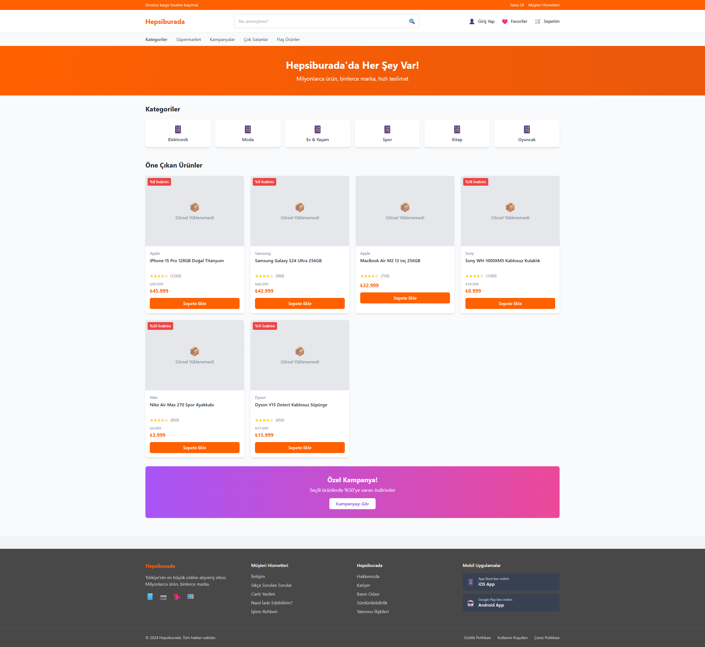
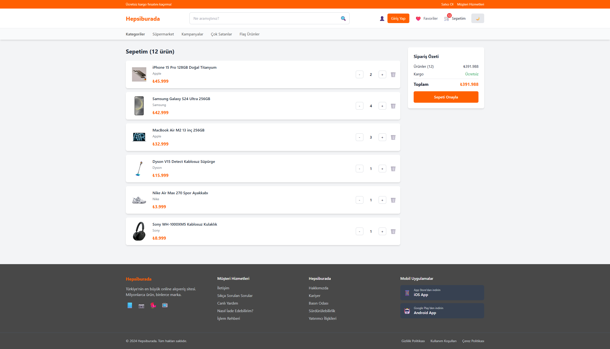

# Hepsiburada Clone

Bu proje, **Hepsiburada** benzeri bir e-ticaret uygulamasıdır. 
Kullanıcılar ürünleri görebilir, sepete ekleyebilir ve sepetlerini yönetebilir. 
Proje, React teknolojileri ve TypeScript kullanılarak Tailwind ile geliştirilmiştir.

## 🚀 Özellikler

- **Ürün Listeleme
- **Sepet Yönetimi
- **Redux Toolkit
- **Responsive Tasarım
- **TypeScript
- **Mock Veri Kullanımı

## 📸 Ekran Görüntüleri

### Ana Sayfa

### Sepet Sayfası

---

## 🛠️ Kullanılan Teknolojiler

- **React.js**
- **TypeScript**
- **Redux Toolkit**
- **React Router**
- **Tailwind CSS**
- **React Icons**

## Projeyi Kurma Adımları

**Projeyi Klonlayın**:
   git clone https://github.com/ismailkiziltas/hepsiburada-react-clone.git
   cd hepsiburada-react-clone
   npm install
   npm start